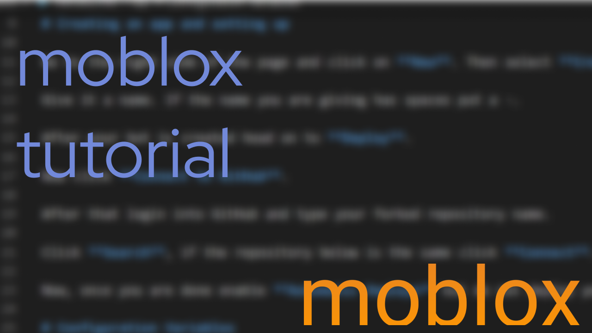

    

  
   
  

<h1 align="center">Documentation can be found below</h1>

# [Tutorial Video](https://www.youtube.com/watch?v=BVPKKGRoSVA&t=3s)

## Steps to host without changing the code

1. Fork the repo to your own github account.
   
1. [Create a bot in the Discord developer portal.](/docs/developer-portal.md)
1. [Get the Roblox bot cookie.](https://www.youtube.com/watch?v=zHODmGst480)
1. [Create a firebase project and setup the database.](/docs/firebase.md)
1. [Heroku Hosting](/docs/heroku.md)

### Running development mode

1. Install node.js
1. Clone the repo
1. Run npm install (if yarn then run yarn install)
1. Run npm dev to start the bot

(If you would like to help do this part please open a pull request and I'll check)
